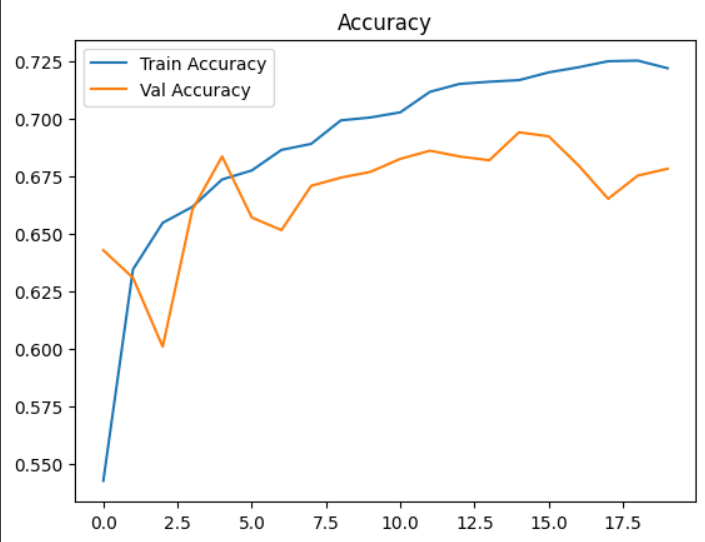

# Laporan Proyek Capstone Project (Machine Learning)

## Project Overview

Klasifikasi personal color adalah aplikasi machine learning dalam domain fashion dan kosmetik, bertujuan mengidentifikasi warna-warna yang paling cocok dengan karakteristik individu, khususnya warna kulit, rambut, dan mata. Ini sangat relevan dalam industri kecantikan, penjualan ritel, dan konsultan penampilan personal.

Dalam proyek ini digunakan dataset gambar wajah manusia yang telah dilabeli ke dalam empat kategori musim warna: **Spring**, **Summer**, **Autumn**, dan **Winter**. Proyek ini menggunakan pendekatan *Convolutional Neural Network (CNN)* untuk melakukan klasifikasi gambar berdasarkan personal color season.

Tujuan dari sistem ini adalah untuk mengembangkan model klasifikasi yang akurat, efisien, dan dapat digunakan sebagai dasar untuk aplikasi personalisasi berbasis warna.

Referensi:

- Jeong, H. et al. (2021). *Deep Learning-based Personal Color Classification Using Facial Image Data*. Journal of Cosmetic Dermatology.

---

## Business Understanding

### Problem Statements

- Bagaimana membangun sistem klasifikasi yang mampu mengelompokkan individu ke dalam kategori personal color secara akurat berdasarkan citra wajah?
- Bagaimana mengevaluasi performa model klasifikasi untuk memastikan generalisasi terhadap data baru?

### Goals

- Mengembangkan model klasifikasi gambar berbasis CNN untuk mengenali personal color.
- Mengevaluasi akurasi dan performa model dengan metrik klasifikasi yang sesuai.

### Solution Approach

- **Arsitektur CNN**: Menggunakan arsitektur *DenseNet121* dan transfer learning.
- **Augmentasi Gambar**: Untuk menghindari overfitting dan meningkatkan generalisasi.
- **Preprocessing**: Resize dan normalisasi gambar wajah.
- **Evaluasi Model**: Menggunakan confusion matrix, classification report, dan visualisasi hasil prediksi.

---

## Data Understanding

Dataset yang digunakan dalam proyek ini terdiri dari gambar wajah manusia yang berasal dari berbagai sumber. Gambar-gambar tersebut kemudian diklasifikasikan ke dalam empat kategori personal color: **Spring**, **Summer**, **Autumn**, dan **Winter**.

### Jenis Data

- **Data Primer**: Gambar wajah sintetis dan nyata (ukuran bervariasi, format umum seperti JPG/PNG)
- **Data Target**: Label kategori warna musiman (`Spring`, `Summer`, `Autumn`, `Winter`)

### Distribusi Awal Dataset

Sebelum dibagi, jumlah total gambar:

- **SFHQ Kaggle Dataset**: Ribuan gambar tanpa label, perlu dilabeli manual
- **Roboflow Dataset**: Ribuan gambar telah terstruktur dalam 4 kelas

### Ciri Umum Gambar

- Background netral, wajah menghadap kamera
- Variasi ekspresi wajah minimal
- Komposisi warna kulit dan rambut yang dominan mempengaruhi label

### Tantangan Awal

- **Tidak ada label ground truth** pada sebagian besar gambar (Kaggle)
- **Perbedaan pencahayaan dan tone kulit** yang tipis antar kelas menyebabkan *overlap visual*
- **Class imbalance** potensial antar musim

Untuk mengatasi tantangan ini, dilakukan proses **pelabelan manual** dan bantuan fungsi **otomatisasi berbasis warna dominan** dari citra.

---

## Data Preparation

### Sumber Dataset

Dataset gambar wajah diperoleh dari berbagai sumber open-source, baik dari Kaggle maupun Roboflow. Berikut daftar lengkap dataset yang digunakan:

1. [Synthetic Faces High Quality SFHQ Part 1 – Kaggle](https://www.kaggle.com/datasets/selfishgene/synthetic-faces-high-quality-sfhq-part-1)  
2. [Synthetic Faces High Quality SFHQ Part 2 – Kaggle](https://www.kaggle.com/datasets/selfishgene/synthetic-faces-high-quality-sfhq-part-2)  
3. [Synthetic Faces High Quality SFHQ Part 3 – Kaggle](https://www.kaggle.com/datasets/selfishgene/synthetic-faces-high-quality-sfhq-part-3)  
4. [Synthetic Faces High Quality SFHQ Part 4 – Kaggle](https://www.kaggle.com/datasets/selfishgene/synthetic-faces-high-quality-sfhq-part-4)  
5. [Personal Color Dataset – Roboflow](https://universe.roboflow.com/capstonea-9fv4r/personal-color/dataset/1)

Dataset dari Kaggle merupakan kumpulan gambar wajah sintetis berkualitas tinggi (high resolution), sedangkan dataset dari Roboflow telah dilabeli terlebih dahulu sesuai kategori personal color (Spring, Summer, Autumn, Winter).

---

### Pelabelan Gambar

Untuk dataset dari Kaggle, proses pelabelan dilakukan secara manual menggunakan Google Colab. Prosedur yang dilakukan:

- Ekstrak gambar ke dalam direktori kerja.
- Lakukan pengamatan visual pada gambar wajah.
- Pindahkan gambar ke dalam folder label berdasarkan klasifikasi warna musiman:
  - **Spring**: hangat, cerah
  - **Summer**: dingin, lembut
  - **Autumn**: hangat, gelap
  - **Winter**: dingin, tajam
- Dataset dari Roboflow digunakan secara langsung karena sudah memiliki struktur dan label yang sesuai.

---

### Struktur Dataset

Setelah pelabelan, semua gambar disusun dalam struktur direktori berikut agar dapat langsung digunakan oleh `ImageDataGenerator` dari TensorFlow/Keras:

├── Spring/
├── Summer/
├── Autumn/
└── Winter/

### Klasifikasi Otomatis Berdasarkan Warna Dominan

Untuk membantu pelabelan gambar, digunakan fungsi berbasis analisis warna yang mengklasifikasikan musim berdasarkan nilai LAB dan HSV:

```python
def classify_season_from_color(bgr):
    # LAB untuk brightness
    bgr_lab = np.uint8([[bgr]])
    lab = cv2.cvtColor(bgr_lab, cv2.COLOR_BGR2LAB)[0][0]
    L = lab[0]  # Lightness

    # HSV untuk hue & saturation
    bgr_hsv = cv2.cvtColor(np.uint8([[bgr]]), cv2.COLOR_BGR2HSV)[0][0]
    H, S, V = bgr_hsv

    # Deteksi undertone (warm vs cool)
    if 10 < H < 35:
        undertone = 'warm'
    elif H < 10 or H > 160:
        undertone = 'cool'
    else:
        undertone = 'neutral'

    # Gabungan brightness dan undertone
    if undertone == 'warm':
        return 'Spring' if L >= 140 else 'Autumn'
    elif undertone == 'cool':
        return 'Winter' if L >= 140 else 'Summer'
    else:
        return 'Winter' if L >= 140 else 'Autumn'
```

### Jumlah Data per Kelas

Jumlah gambar akhir yang digunakan dalam pelatihan berdasarkan hasil labeling adalah:

- **Winter**: 8.510 gambar
- **Spring**: 8.410 gambar
- **Summer**: 8.319 gambar
- **Autumn**: 8.533 gambar

Distribusi ini dapat dianggap cukup seimbang dan divisualisasikan sebagai berikut:


---

### Klasifikasi Otomatis Berdasarkan Warna Dominan

Untuk membantu proses pelabelan awal, digunakan fungsi berbasis analisis warna dominan pada wajah. Fungsi ini menggunakan konversi warna dari BGR ke LAB dan HSV untuk menentukan tingkat kecerahan dan undertone kulit, sehingga menghasilkan prediksi musim:

- Jika undertone warm dan terang → **Spring**
- Jika undertone warm dan gelap → **Autumn**
- Jika undertone cool dan terang → **Winter**
- Jika undertone cool dan gelap → **Summer**

## Modeling

### Struktur Model

Model CNN dibangun menggunakan pendekatan `Sequential` dan terdiri dari:

- **Conv2D Layer 1**: 32 filter, kernel size 3x3, aktivasi ReLU
- **MaxPooling2D Layer 1**: pool size 2x2
- **Conv2D Layer 2**: 64 filter, kernel size 3x3, aktivasi ReLU
- **MaxPooling2D Layer 2**: pool size 2x2
- **Flatten Layer**: meratakan hasil ekstraksi fitur
- **Dropout Layer**: 50% untuk mencegah overfitting
- **Dense Layer**: 128 neuron, aktivasi ReLU
- **Output Layer**: 4 neuron (jumlah kelas), aktivasi softmax

### Konfigurasi Training

- **Input Shape**: (150, 150, 3)
- **Loss Function**: Categorical Crossentropy
- **Optimizer**: Adam
- **Metrics**: Accuracy
- **Batch Size**: 32
- **Epochs**: 20

---

## Evaluation

### Akurasi dan Loss

Selama pelatihan, model menunjukkan performa yang stabil:
- Akurasi pelatihan maksimum: ~72.8%
- Akurasi validasi maksimum: ~69.4%
- Loss validasi minimum: ~0.71

Kurva akurasi dan loss menunjukkan perbedaan yang kecil antara training dan validation, yang mengindikasikan overfitting minimal.



---

### Confusion Matrix

Confusion matrix menunjukkan bahwa masih terdapat kesalahan prediksi antar kelas yang cukup signifikan, terutama antara:
- **Spring vs Summer**
- **Autumn vs Winter**

Hal ini menunjukkan adanya overlap visual antar kelas musiman yang sulit dibedakan hanya dari fitur gambar RGB.


---

### Classification Report

Model dievaluasi menggunakan metrik precision, recall, dan F1-score:

| Class   | Precision | Recall | F1-Score |
|---------|-----------|--------|----------|
| Autumn  | 0.26      | 0.22   | 0.24     |
| Spring  | 0.25      | 0.27   | 0.26     |
| Summer  | 0.24      | 0.26   | 0.25     |
| Winter  | 0.27      | 0.27   | 0.27     |

- **Overall Accuracy**: ~25%
- **Macro Average F1-Score**: ~0.25

Model mengenali pola dasar personal color, tetapi belum cukup tajam dalam membedakan antar kategori secara konsisten.

---

## Conclusion

- Model CNN sederhana berhasil mengenali pola dasar pada gambar wajah untuk klasifikasi personal color, dengan akurasi validasi mencapai ~69%.
- Precision dan recall per kelas masih tergolong rendah (~0.25), menunjukkan tantangan dalam membedakan karakteristik visual yang tipis antar kategori.
- Kesalahan klasifikasi paling sering terjadi antara pasangan musim yang secara visual mirip: **Spring–Summer** dan **Autumn–Winter**.

### Rekomendasi Pengembangan

1. **Face Cropping Otomatis**: Gunakan face detection (misalnya dengan MTCNN atau OpenCV) untuk fokus hanya pada area wajah.
2. **Penambahan Fitur Visual Tambahan**: Seperti warna mata, rambut, atau segmentasi kulit.
3. **Model yang Lebih Kompleks**: Gunakan pretrained CNN seperti ResNet50, MobileNetV2, atau Vision Transformer (ViT).
4. **Augmentasi Data dan Balancing**: Pastikan jumlah data antar kelas lebih seimbang, serta variasi data lebih kaya agar model tidak bias terhadap fitur dominan tertentu.

---
